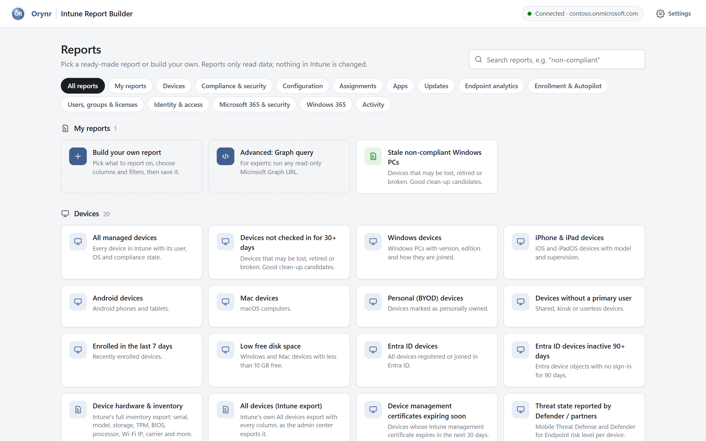
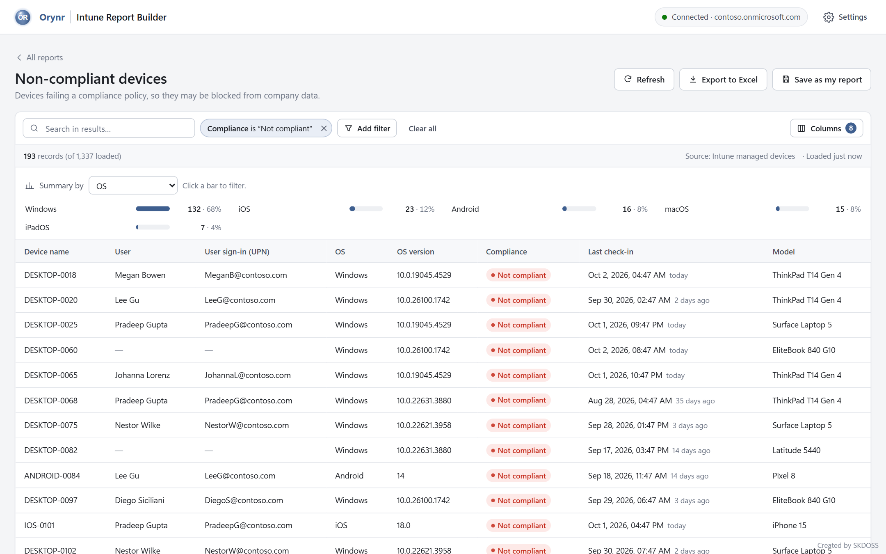
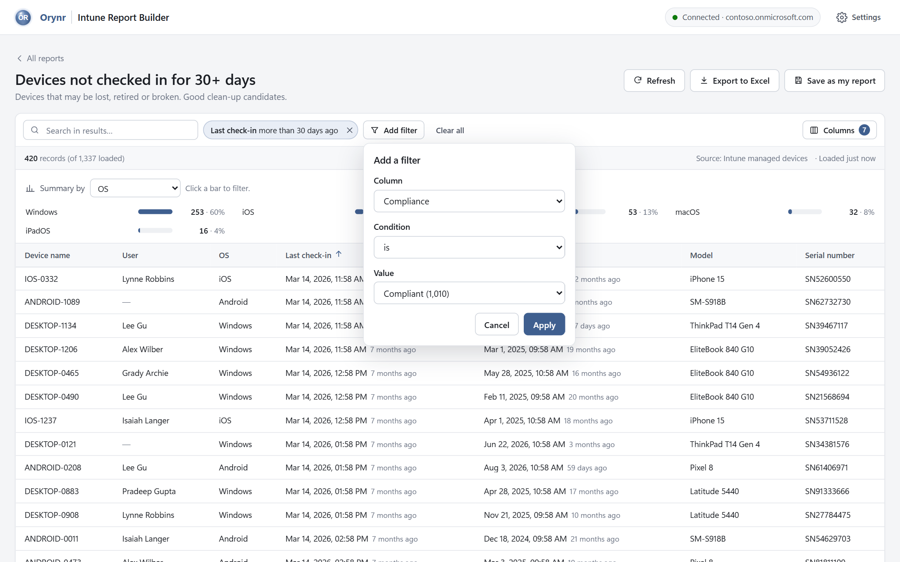
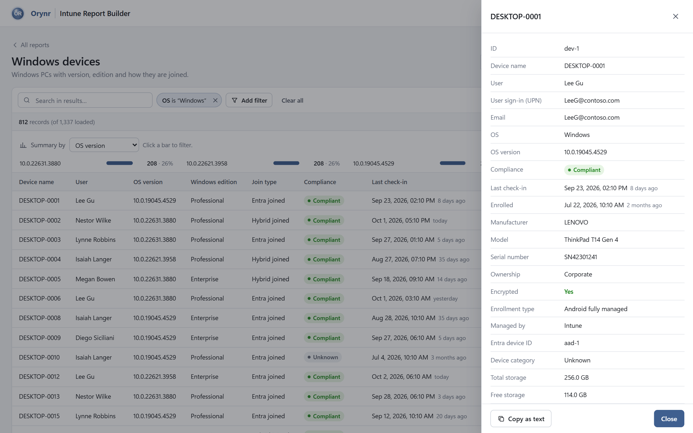
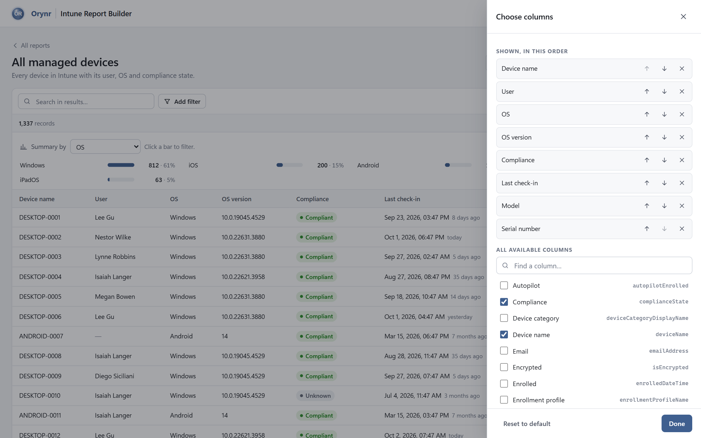
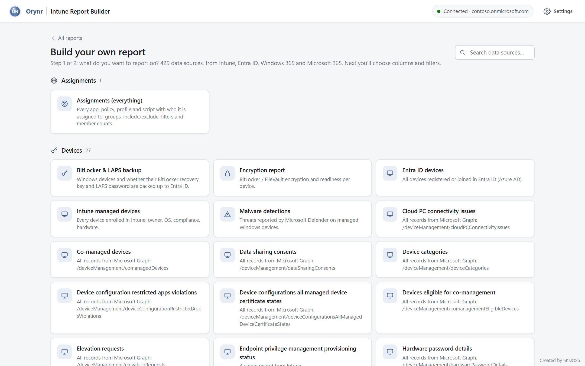
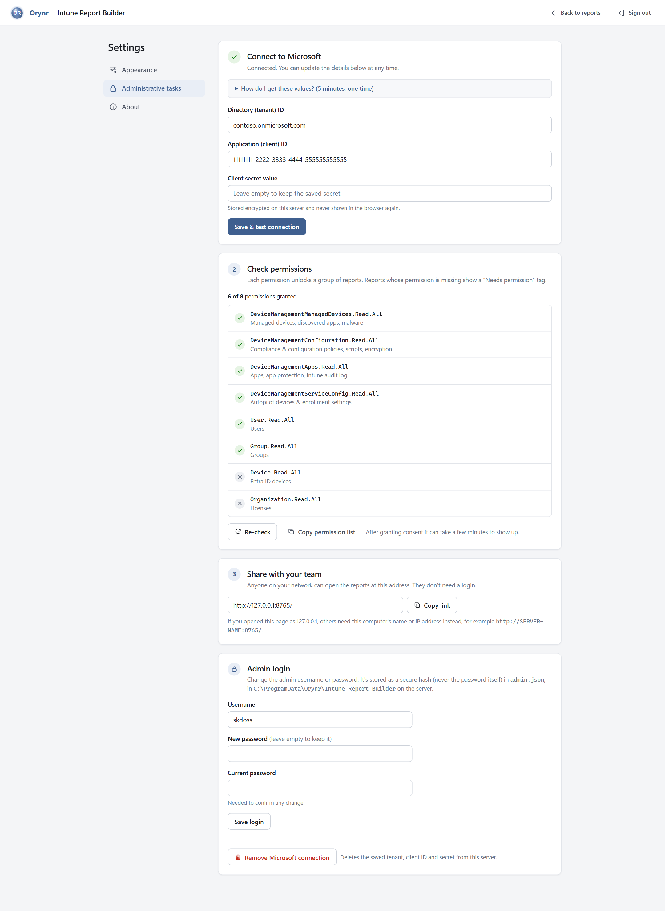
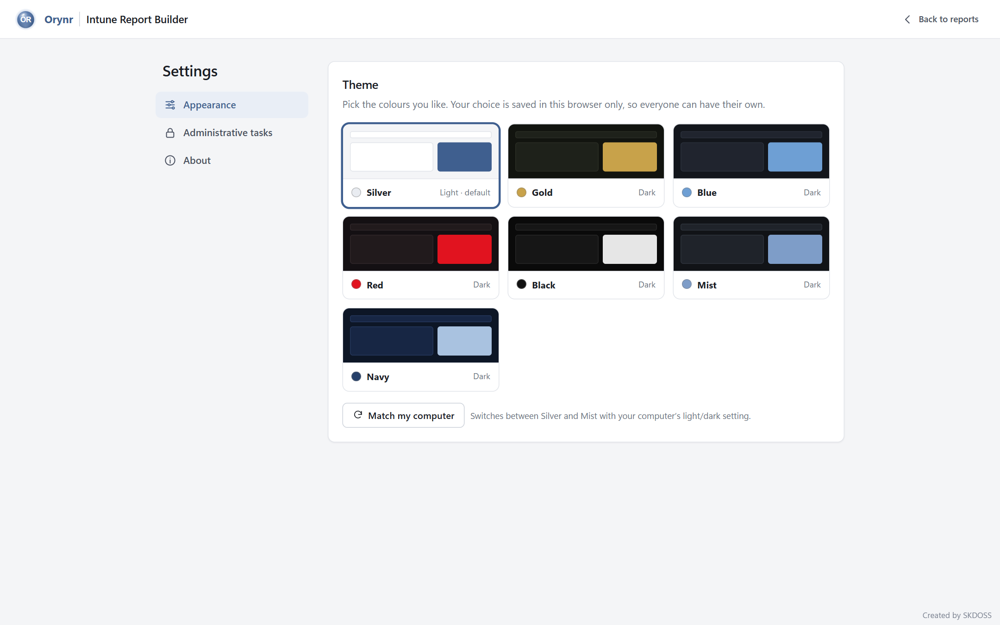
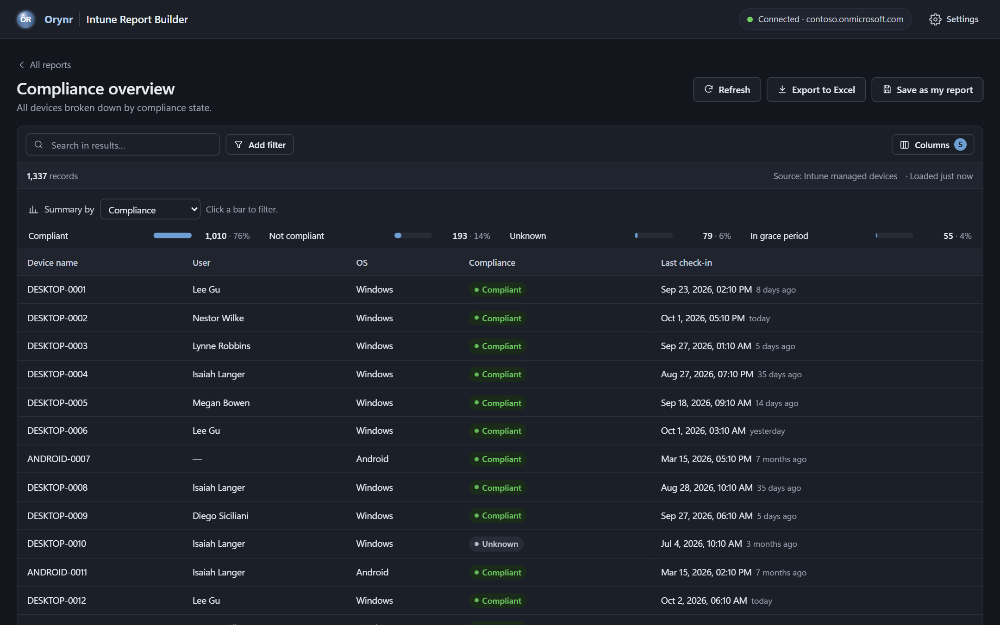

<p align="center">
  
</p>

<h1 align="center">Intune Report Builder</h1>

<p align="center">
  <b>Ready-made Microsoft Intune reports anyone can read: in your browser, on your own server.</b><br>
  Free to use for Intune reporting · by <b>Orynr</b> · developed by SKDOSS
</p>

<h3 align="center">
  ⬇️ <a href="https://github.com/SKD0007/Intune-Report-Builder/releases/download/v2.0.12/Orynr-IntuneReportBuilder-Setup-2.0.12.exe">Download the Windows installer (Orynr-IntuneReportBuilder-Setup-2.0.12.exe, 15 MB)</a>
</h3>
<p align="center">
  Or see <a href="https://github.com/SKD0007/Intune-Report-Builder/releases">all releases</a> · Install steps <a href="#install">below</a>
</p>

<p align="center">
  <a href="LICENSE"></a>
  
</p>

<p align="center">
  <a href="https://github.com/SKD0007/Intune-Report-Builder/releases/latest"></a>
</p>

<p align="center">
  
</p>

---

## What it does

Intune Report Builder connects to your Microsoft tenant **read-only** and turns Intune, Entra ID, Windows 365 and Microsoft 365 data into clear, ready-made reports:

- **159 reports out of the box:** non-compliant devices and the exact failing settings, devices that haven't checked in, hardware inventory (TPM, BIOS, storage), app install status and failures per device, Defender and firewall health, Windows / iOS / macOS update status, Endpoint analytics (startup, app reliability, battery, Windows 11 readiness), enrollment and Autopilot failures, licenses per user, inactive users, MFA registration, admin roles, Conditional Access, app secrets about to expire, Microsoft 365 service health and the message center.
- **Every data set there is:** over 400 data sources to build your own reports from, covering every Intune area (generated from Microsoft Graph's own schema, so nothing is left out), Intune's built-in exportable reports, Windows 365, Entra ID and Microsoft 365. Devices, users and groups come with every available field.
- **Who gets what:** one list of everything assigned in Intune (apps, compliance, configuration, settings catalog, endpoint security, baselines, scripts, remediations, Windows updates, Autopilot, enrollment, app protection, policy sets and more) with the group, include/exclude, assignment filter and how many devices and users each group holds. Spot assignments to All users / All devices, exclusions, filters in use, and assignments to empty or deleted groups.
- **App deep-dive:** versions, install commands, run-as context and detection rules for every app, plus supersedence and dependencies, with supersedence flagged when both apps are detected the same way.
- **Health checks:** Apple push certificate, Apple enrollment and VPP token expiry, Managed Google Play and connector sync, Windows devices without a BitLocker recovery key or LAPS password in Entra ID, and Autopilot devices whose Entra ID device is missing.
- **Plain English everywhere:** `complianceState: noncompliant` becomes a red **Not compliant** badge, `lastSyncDateTime` becomes **Last check-in: 35 days ago**, and `freeStorageSpaceInBytes` becomes **Free storage: 12.4 GB**.
- **Filter, summarize, drill in:** add filters from drop-downs of real values, click a summary bar to narrow down, and click any row to see every detail of that device, user or app.
- **Export to Excel** with readable headers and values, exactly as you see it.
- **Update notifier:** an *Update available* button appears when a new version is published, with a direct download link.
- **Your branding:** show your organisation's name and logo in the top bar and page titles (Settings → Administrative tasks).
- **No waiting around:** reports Intune has to prepare first show *We're preparing this report*. Wait, cancel, or choose **Notify me** and carry on; the bell at the top right tells you when it's ready, and one click opens it.
- **Knows your licences:** the app detects whether your tenant has Microsoft Intune, Entra ID P1/P2, Windows 365 and Defender for Endpoint, tags the reports that need something you don't have, and lists what you have in Settings.
- **Save your own reports:** columns, filters and sort order are saved for the whole team, and the data is always fetched fresh.
- **Build your own:** pick any data source, choose columns and filters, and save it. Experts can run any read-only Microsoft Graph query.

## The gap it fills

| Today | With Intune Report Builder |
|---|---|
| Intune reports are spread across many admin-center pages, and viewers need an Intune admin role. | One page of reports. Viewers need only a browser link, not admin-center access or a Microsoft licence. |
| Exports are raw field names and codes that have to be cleaned up in Excel. | Exports have readable column names, translated values and proper dates, ready to share. |
| Custom reports mean PowerShell or Microsoft Graph scripting. | Point-and-click filters and columns. Save a report once, reuse it every week. |
| Dashboard tools need extra licences, data pipelines and BI skills. | A single installer on one Windows server. Nothing to host in the cloud. |
| Third-party reporting services copy your tenant data to their cloud. | Your data goes only from Microsoft to your server and your users' browsers. Nothing is sent to Orynr. |

## Screenshots

<table>
  <tr>
    <td width="50%"><br><sub><b>Non-compliant devices</b>, with a clickable summary by operating system</sub></td>
    <td width="50%"><br><sub><b>Add filter</b> offers the real values found in your data</sub></td>
  </tr>
  <tr>
    <td><br><sub><b>Click any row</b> to see every detail of a device</sub></td>
    <td><br><sub><b>Choose columns</b> and their order</sub></td>
  </tr>
  <tr>
    <td><br><sub><b>Build your own report</b> from any data source</sub></td>
    <td><br><sub><b>Guided setup</b> with a live permission checklist</sub></td>
  </tr>
  <tr>
    <td><br><sub><b>Orynr themes:</b> Silver (default), Gold, Blue, Red, Black, Mist, Navy</sub></td>
    <td><br><sub>The <b>Blue</b> theme</sub></td>
  </tr>
</table>

<sub>Screenshots use a demo tenant (contoso.onmicrosoft.com) with sample data.</sub>

## Install

1. Download **Orynr-IntuneReportBuilder-Setup-<version>.exe** from the [latest release](https://github.com/SKD0007/Intune-Report-Builder/releases/latest) (under **Assets**).
2. Run it on the Windows server or PC that will host the reports (Windows 10/11 or Windows Server 2016+, 64-bit). You'll need administrator rights.
3. Choose a port (default **8080**) and whether other computers on your network may open the reports.
4. Click **Finish**. The reports page opens at `http://127.0.0.1:8080/settings`.

The installer sets up a Windows service called **Orynr Intune Report** (service name `ORIP`) that starts automatically with Windows. Program files go to `C:\Program Files\Orynr\Intune Report Builder` (read-only for normal users). Settings and saved reports go to `C:\ProgramData\Orynr\Intune Report Builder`, which only administrators can read, and they are kept when you upgrade.

## Managing the service

The installer runs Intune Report Builder as a Windows service, so there is no window to keep open. It starts automatically with Windows and restarts itself if it ever stops unexpectedly.

| To… | Do this |
|---|---|
| **Open the reports** | Start menu → **Orynr Intune Report Builder**, or browse to `http://<server-name>:8080/` |
| **Check it's running** | Open **Services** (`services.msc`) and find **Orynr Intune Report**. Status should be *Running*. |
| **Stop, start or restart** | In **Services**, right-click **Orynr Intune Report** and choose **Stop**, **Start** or **Restart**. Or, from an admin PowerShell: `Restart-Service ORIP` |
| **Change the port or network sharing** | Run the installer again and pick new values; settings and saved reports are kept. |
| **See what went wrong** | Open the log `C:\ProgramData\Orynr\Intune Report Builder\logs\service.log` (admin rights needed). |
| **Run it by hand for troubleshooting** | Stop the service, then run `"C:\Program Files\Orynr\Intune Report Builder\OrynrIntuneReportBuilder.exe"` from an admin Command Prompt. It runs in that window and prints errors there; press Ctrl+C to stop, then start the service again. |

From an admin Command Prompt you can also use Windows' own service commands:

```bat
sc query ORIP
sc stop ORIP
sc start ORIP
```

## One-time setup (about 5 minutes)

On the server, open **Settings → Administrative tasks**:

1. **Create the admin login** (username and password). Only Administrative tasks need it. Viewing reports and changing the theme don't.
2. **Connect to Microsoft:** create an app registration in Entra ID (the page walks you through it) and paste the Tenant ID, Client ID and client secret. The secret is stored encrypted and never sent to a browser.
3. **Grant permissions:** add these Microsoft Graph **application** permissions and click **Grant admin consent**. Settings shows which ones are granted, and which Microsoft licences your tenant has.

   **Core** (the Intune, user and group reports):

| Permission | Unlocks |
|---|---|
| DeviceManagementManagedDevices.Read.All | Managed devices, hardware inventory, discovered apps, malware, Endpoint analytics |
| DeviceManagementConfiguration.Read.All | Compliance & configuration policies and their assignments, scripts, encryption |
| DeviceManagementApps.Read.All | Apps, app assignments, install status, supersedence & dependencies, app protection, Intune audit log |
| DeviceManagementServiceConfig.Read.All | Autopilot, enrollment settings, connectors & Apple tokens |
| User.Read.All · Group.Read.All · Device.Read.All | Users, groups (and group names and member counts in assignment reports), Entra ID devices |
| Organization.Read.All | Licenses, and detecting which Microsoft licences your tenant has |

   **Optional** (add only the ones you want; reports that need a missing one say so):

| Permission | Unlocks | Licence needed |
|---|---|---|
| BitLockerKey.ReadBasic.All | Which Windows devices have a BitLocker recovery key in Entra ID. *Basic* means the keys themselves can't be read. | |
| DeviceLocalCredential.ReadBasic.All | Which Windows devices have a LAPS password backed up. *Basic* means the passwords themselves can't be read. | |
| DeviceManagementRBAC.Read.All | Intune roles, role assignments and scope tags | |
| CloudPC.Read.All | Windows 365 Cloud PCs, provisioning and connections | Windows 365 |
| Application.Read.All | App registrations and enterprise apps, including when their secrets and certificates expire | |
| Policy.Read.All | Conditional Access, named locations, authentication methods, tenant policies | Entra ID P1 (Conditional Access) |
| AuditLog.Read.All | Last sign-in per user, MFA registration, sign-in and Entra audit logs | Entra ID P1 (sign-ins, MFA registration) |
| RoleManagement.Read.Directory | Entra ID admin roles, and eligible (PIM) roles | Entra ID P2 (PIM) |
| ServiceHealth.Read.All · ServiceMessage.Read.All | Microsoft 365 service health and message center | |
| SecurityEvents.Read.All · SecurityAlert.Read.All · SecurityIncident.Read.All | Secure Score, Defender XDR alerts and incidents | Defender (alerts, incidents) |
| IdentityRiskyUser.Read.All · IdentityRiskEvent.Read.All | Risky users and risk detections | Entra ID P2 |
| Directory.Read.All | Domains, administrative units, app consents, deleted users and groups | |

   All Intune reports need a Microsoft Intune licence in the tenant.

4. **Share the link** `http://<server-name>:8080/` with your team.

## Security and privacy

- **Read-only:** the app only ever reads; nothing in your tenant is changed. Requests go only to `graph.microsoft.com`, and all of them are reads (GET) except one kind: for Intune's own built-in reports, it asks Intune to prepare the report (`POST /deviceManagement/reports/exportJobs`) and then downloads it from the temporary Azure Storage link Intune hands back (`*.blob.core.windows.net`). No Microsoft token is ever sent to that link.
- **Least privilege:** the service runs as the built-in low-privilege *Local Service* account.
- **Secrets stay on the server:** the client secret is encrypted at rest and never returned to a browser. The admin password is stored only as a salted hash.
- **Locked-down settings page:** first-time admin setup only works on the server itself, sign-in locks out after repeated wrong passwords, and the web pages are served with strict security headers.
- **No phone-home:** nothing is sent to Orynr, and none of your tenant data leaves your network.
- **Update notifier:** once a day the server asks GitHub whether a newer version exists and shows an *Update available* button. Only the app's version number is sent, and nothing is downloaded or installed automatically. Admins can switch it off in **Settings → Administrative tasks**.

> Anyone who can open the reports link can see the reports. Share it only with people who should see your device and user data, and keep the firewall option limited to trusted networks.

## Uninstall

Use **Settings → Apps** (or *Add or remove programs*). Everything is removed: the service, the firewall rule and all saved data (the Microsoft connection including its client secret, the admin login, saved reports, branding and logs). Installing a new version over an old one is not an uninstall, so upgrades keep your settings.

## License

Intune Report Builder is licensed under the **[Apache License 2.0](LICENSE)**.

**You may** use, modify and distribute it, including commercially, as long as you:

- **give credit:** keep the copyright notice, the [`NOTICE`](NOTICE) file and the license text with any copy or derived work;
- **mark your changes:** state clearly in files you modified that you changed them;
- **don't use the Orynr name or logo** to brand or endorse your own product (trademarks are not licensed; see `NOTICE`).

The software is provided "as is", without warranty of any kind (sections 7 and 8 of the license). The installed app includes open-source components under their own licenses, listed in its `THIRD_PARTY_LICENSES` folder.

Microsoft, Intune, Entra and Excel are trademarks of the Microsoft group of companies. Intune Report Builder is not affiliated with or endorsed by Microsoft.

## Contact

**Orynr LLC** · [orynr.com](https://orynr.com) · [info@orynr.com](mailto:info@orynr.com)
Developed by **SKDOSS**
